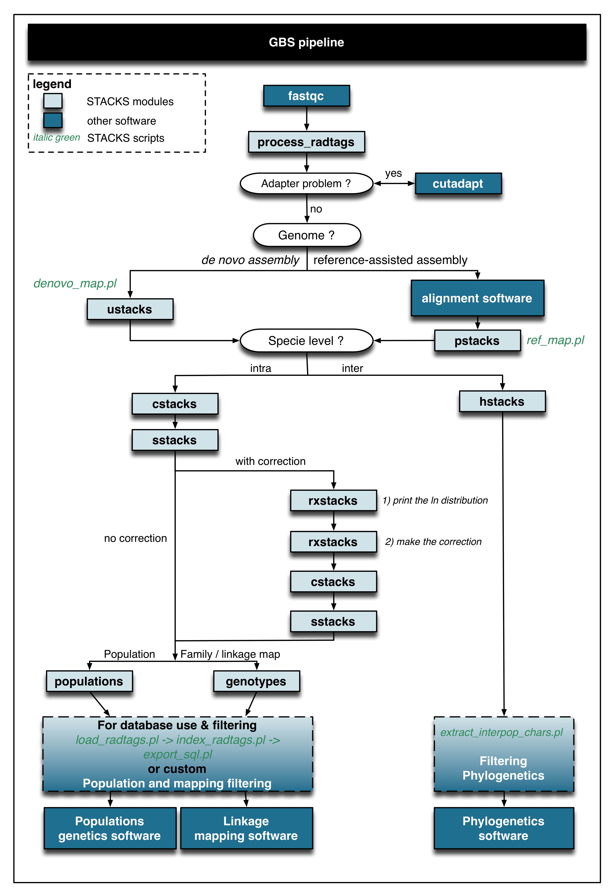

# stackr

[](https://travis-ci.org/thierrygosselin/stackr)

The goal of **stackr** is to make GBS/RAD data produced by [STACKS] (http://creskolab.uoregon.edu/stacks/) easy to analyse in R.

This is the development page of the **stackr** package for the R software.

* Optimized for *de novo* and population genetics
* Read and modify *batch_x.sumstats.tsv* and *batch_x.haplotypes.tsv* files.
* Transform the VCF file, *batch_x.vcf*, into a tidy format to visualise and filter summary statistics within R.
* Filters genetic markers based on: coverage (read depth, REF and ALT allele depth), genotype likelihood, the number of individuals, the number of populations, observed heterozygosity and inbreeding coefficient (Fis).
* View distribution of summary statistics and create publication-ready figures
* Convert data into genind object for easy integration with **adegenet**, **hierfstat** and **pegas**.

## Roadmap of what's up next

* Documentation and vignette.
* Tutorial of workflow.
* Use Shiny and ggvis when subplots or facet available.
* Linkage map tools.
* CRAN.
* Interaction with [STACKS] (http://creskolab.uoregon.edu/stacks/) database (Web-interface).
* Reference genome tools.
* Maybe try some integration with other GBS approaches: AftrRAD, pyRAD, dDocent.
* Got ideas ?


## Installation
You can try out the dev version of *stackr*. You will need the package *devtools* and the dev version of *readr*

```r
install.packages("devtools")
install_github("hadley/readr")
install_github("thierrygosselin/stackr")
library("stackr")
```

To convert [STACKS] (http://creskolab.uoregon.edu/stacks/) haplotypes file to strataG *gtypes* object you will need to install this package:
```r
install_github("EricArcher/strataG.devel/strataG.devel")
library("strataG.devel")
```
## GBS workflow
The *stackr* package fits currently at the end of the GBS workflow. Below, a flow chart using [STACKS] (http://creskolab.uoregon.edu/stacks/) and other software. 
